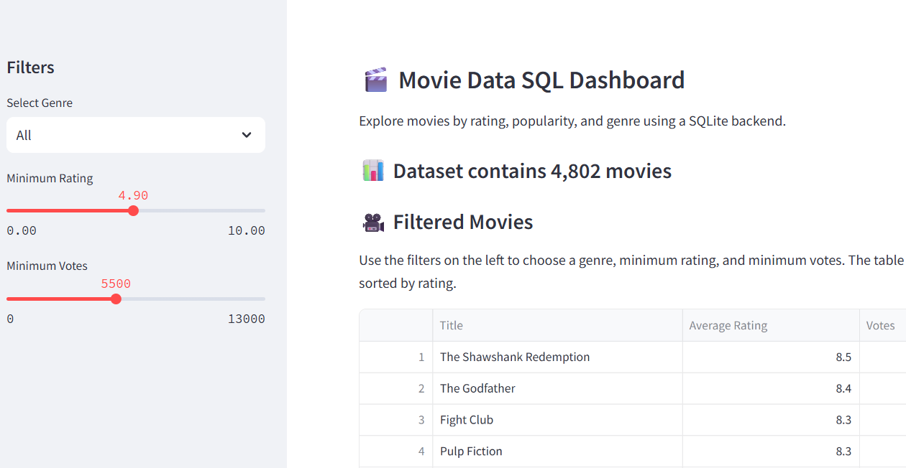
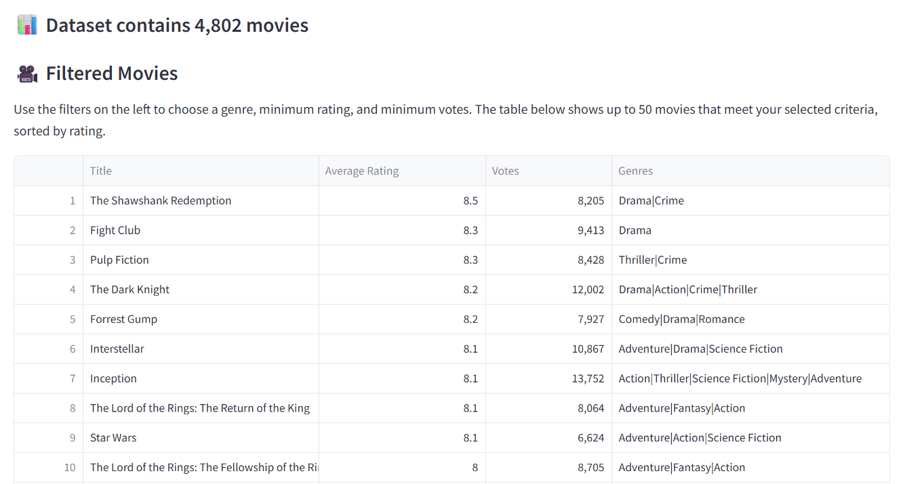
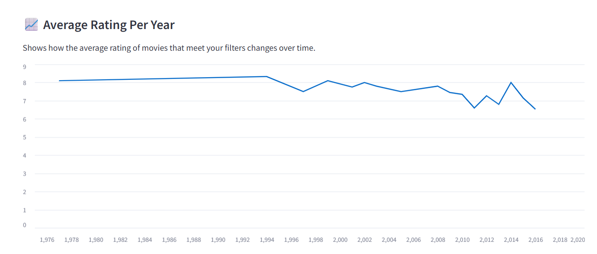
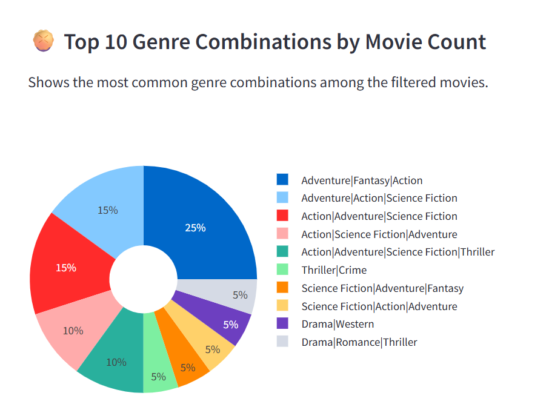

# Movie Data SQL Dashboard

*From raw CSVs to clean dashboards — an end-to-end ETL pipeline with live visual insights.*
---

## 🎯 **Try it live:** [Movie Data SQL Dashboard](https://j7ncofvcdyyuu6ggmftsapp.streamlit.app/)
<p align="left">
  
</p>
<p align="left">
  
</p>
<p align="left">
  
</p>
<p align="left">
  
</p>
---

## 📊 What This Project Does

This project lets you explore a movie dataset using *live filters* and dynamic visualizations. It combines a full *ETL pipeline* (cleaning and loading the data into SQL) with an *interactive dashboard* to help you answer questions like:

- What are the top-rated movies with at least 4,000 votes?
- How have average movie ratings changed over time?
- What genres appear most often in those kinds of movies?

---

## 🧭 How It Works

1. **Filter the Dataset (Left Panel):**  
   Start by choosing:
   - A *minimum rating* (e.g., only show movies rated 6 or above)
   - A *minimum number of votes* (e.g., at least 4,000 votes)
   - An optional *genre*

2. **See Filtered Results (Right Panel):**  
   Based on the filters you set, the dashboard updates automatically:

   - ✅ A *movie table* shows the top 50 matching titles, sorted by rating  
   - 📈 A *line chart* displays the *average rating per year*  
   - 🥧 A *pie chart* shows the *most common genre combinations*

---
## ⚙️ Features Overview

### 🔄 End-to-End ETL Pipeline

- **Loads raw CSV files** from the `data/` folder and reads them into pandas for processing  
  *Simulates receiving raw files in a real-world data pipeline*

- **Cleans and transforms the dataset** by:
  - Removing rows with missing titles
  - Extracting the release year from full dates
  - Flattening JSON-like genre fields into pipe-separated strings like `Action|Adventure`
  - Trimming whitespace and keeping only analysis-ready columns  
  *Ensures the data is consistent, readable, and SQL-friendly*

- **Saves the cleaned data** into a local **SQLite database (`data.db`)**  
  *Provides fast access to data via SQL queries for dashboarding and analysis*

- **Archives the original raw file** by moving it to an `archive/` folder after processing  
  *Prevents duplicate processing and simulates a production ETL workflow*

- **Fully automated pipeline:** The entire ETL process can be triggered with a single function (`load_csv_to_sqlite()`), making it *modular, repeatable, and scalable*.


### 🧠 SQL Analysis Features

- Filters movies based on **minimum rating**, **minimum vote count**, and **selected genre**
- Returns **top-rated movies** that meet filtering criteria
- Computes **average movie rating per year** for line chart
- Calculates **top 10 genre combinations** for pie chart visualization
- All queries return results as **pandas DataFrames** for easy dashboard integration


## 📂 Project Structure
```
├── app.py     # Streamlit app that powers the interactive dashboard
├── main.py    # Runs the full ETL pipeline from CSV → SQLite
├── etl_utils.py # Core ETL functions (cleaning, transforming, archiving)
├── sql_utils.py # SQL queries for filtering, aggregation, and analysis
├── requirements.txt # Python package dependencies
├── runtime.txt      # Specifies Python version for Streamlit Cloud
├── README.md        # Project documentation
├── LICENSE          # MIT License
├── data.db # SQLite database created from processed movie data
├── movies.db  
├── data/ # Folder containing raw CSVs for ETL input
```

## 🛠️ Tech Stack

### ⚙️ Core Languages & Libraries
- **Python** — Main language for ETL, SQL, and the Streamlit app  
- **SQLite** — Lightweight SQL database to store the cleaned movie data  
- **Pandas** — For loading CSVs, cleaning data, and manipulating query results  
- **Plotly** — For interactive visualizations (line chart + pie chart in Streamlit)  
- **Streamlit** — For building the web dashboard (UI + visual output)

### 🛠️ ETL Tools
- **ast** — Parses stringified JSON fields (used to extract genres from TMDB-style data)  
- **shutil** — Moves archived CSV files to a separate `/archive` folder after processing  
- **pathlib** — Cross-platform file path handling for clean, readable code

### 🗄️ SQL Tools
- **sqlite3** — Python’s built-in library for running SQL queries on the `.db` file  
- **tabulate** — Used during CLI testing to format SQL query results into clean tables

---
## ⚡ Installation / Local Setup Instructions

### 1️⃣ Clone the Repository

```bash
git clone https://github.com/pasampat/movie-data-sql-dashboard.git
cd movie-data-sql-dashboard
```

### 🔹 2. Create a virtual environment
```python -m venv .venv
source .venv/bin/activate    # macOS/Linux
.venv\Scripts\activate       # Windows
```

### 🔹 3. Install dependencies
Make sure you have Python 3.10+
```
pip install -r requirements.txt
```

### 🔹 4. Run the App
```
python main.py
streamlit run app.py
```
